# Efficient and Accurate Arbitrary-Shaped Text Detection with Pixel Aggregation Network(PAN)

# 一、核心思想：

针对已有检测任意形状文本模型很少考虑算法的运行时间和效率问题，该文章提出了一种高效且准确的任意形状文本检测器PAN。具体的：

1、 提出了特征金字塔增强模块（Feature Pyramid Enhancement Module，FPEM）和特征融合模块（Feature Fusion Module，FFM）组成的分割模块；

2、 提出了可学习的后处理像素聚合模块（Pixel Aggregation，PA）；

整个网络主要分为两个步骤：

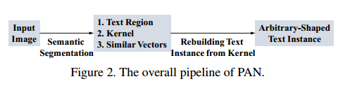

1、用分割模块预测文字区域、kernel以及相似向量；

2、从预测的kernel中重建完整的文字实例；

# 二、网络结构：

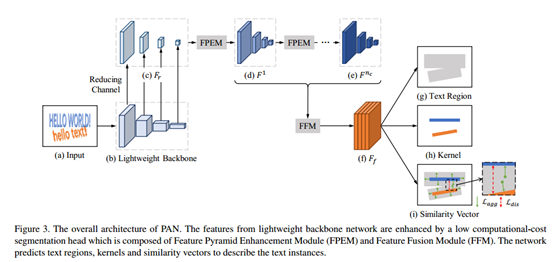

PAN中的backbone采用resnet-18，对于一张输出图片，分别采用4、8、16、32的卷积步长，通过conv2,conv3,conv4和conv5分别产生四个特征图（对应上图中的(b)）;

作者使用1*1卷积将每个特征图的通道数减少到128,同时获取到一个薄(thin)的特征金字塔Fr。（对应上图中的(c)）;

特征金字塔通过nc级联的FPEMs得以增强，每一个FPEM都产生一个增强的特征金字塔，所以会有F1,F2,...,Fnc个增强的特征金字塔。（对应上图中的(d)-(e)）;

特征融合模块FFM将这nc个增强的特征金字塔融合为一个特征图Ff，其步长为4个pixels，通道数为512。（对应上图中的(f)）;

Ff用于预测文本区域、内核kernels和相似度向量。最后，作者使用一个简单高效的后处理算法来获得最后的文本实例。（对应上图中的(g),(h),(i)）;

## 2.1特征金字塔增强模块FPEM

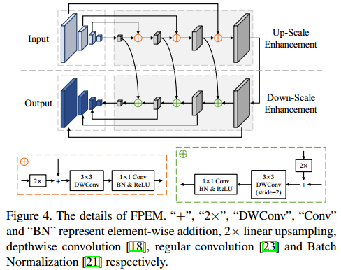

如上图，FPEM是一个U形模组，由两个阶段组成，up-scale增强、down-scale增强。up-scale增强作用于输入的特征金字塔，它以步长32,16,8,4像素在特征图上迭代增强。在down-scale阶段，输入的是由up-scale增强生成的特征金字塔，增强的步长从4到32，同时，down-scale增强输出的的特征金字塔就是最终FPEM的输出。

类似于FPN，FPEM能够通过融合低级与高级信息来增强不同scale的特征。FPEM模块可以看成是一个轻量级的FPN，只不过这个FPEM计算量不大（大约为FPN的1/5），并可以通过不停地级联以达到不断增强特征的作用。

## 2.2特征融合模块FFM

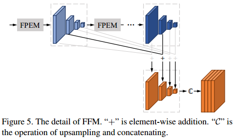

特征融合模组用于融合不同尺度的特征，这是因为低级、高级语义信息对于语义分割来说都很重要。研究人员提出了如上图的特征图融合方法。他们首先通过逐元素相加结合了相应scale的特征图，然后对特征图进行上采样，连接成最终只有4*128通道的特征图Fr。

## 2.3特征融合模块FFM

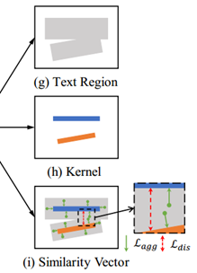

文本区域虽然保持了完整的文本实例形状，但是会经常出现重叠的文本区域如上图(g)。另外，虽然可以使用kernels区分文本实例，如上图(h)，然而这些kernel并非完整的文本实例。为了重建完整的文本实例，需要将文本区域中的像素合并到kernel中，作者提出了一个可学习的算法，即像素聚合（PA），来引导文本像素朝向正确的kernel发展。

# 三、损失函数

损失函数定义为：

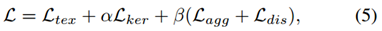

其中Ltex和Lker分别表示文本区域和kernel的loss，Lagg是衡量文本实例中的像素和其对应的kernel的loss（是一个聚合loss，aggregation loss），Ldis是分辨不同文本实例的kernel的一个loss（discrimination loss），α和β用于平衡四个loss的值，作者分别设为0.5和0.25。

考虑到文本像素和非文本像素的极端不平衡性，作者借鉴psenet，使用dice loss去监督文本区域的分割结果Ptex和kernels的分割结果Pker。因此，Ltex和Lker可分别用下列式子表示：

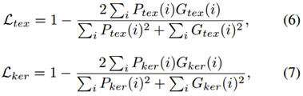

其中Ptex(i)表示分割结果中第i个像素的值，Gtex(i)表示文本区域的ground truth。文本区域的ground truth是一个二进制图像，该二进制图像中文本像素为1，非文本像素为0。

Lagg用于衡量文本实例和其对应kernel的loss，作用是保证同一文本实例的kernel和文本实例内其它像素点之间的距离小于&agg，其公式如下：

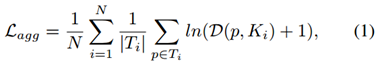

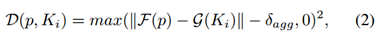

其中N是文本实例的个数，Ti是第i个文本实例，D(p,Ki)定义了像素p和第Ti个文本实例的kernel Ki之间的距离。&agg是一个常量，根据经验设置为0.5，用于过滤容易样本。F(p)是像素p的相似度向量。g(.)是kernel Ki的相似度向量，可以通过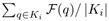来计算。

Ldis是用于不同文本实例的kernel的loss，其作用是保证任意两个kernel之间的距离大于&dis，其公式如下：

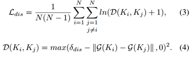

其中，&dis是一个常量，默认为3。

在测试阶段，作者使用预测到的相似性向量来引导文本区域中的像素到相应的内核。后处理步骤细节：

1）在kernel的分割结果中查找连接部分，每个连接部分都是单个kernel。

2）对于每一个kernel Ki，在预测文本区域中有条件地合并其相邻文本像素（4-way）p，而其相似向量的欧几里德距离小于d（文中经过测试设置为6）。

3）重复第二步，直到没有符合条件的相邻文本像素。
